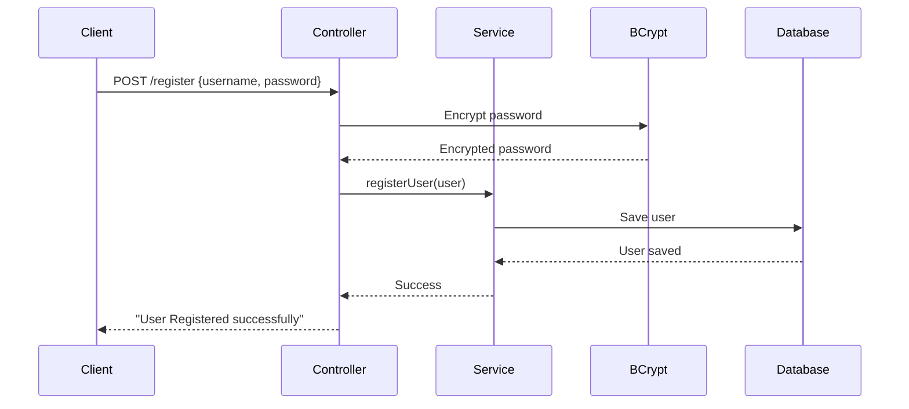
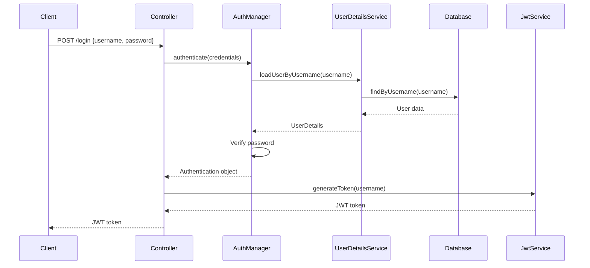
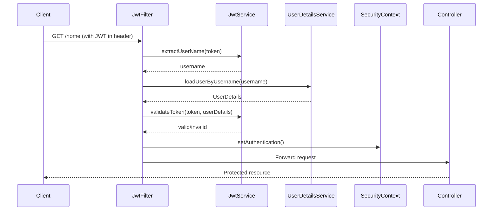

# 🔐 Spring Security with JWT & OAuth2 Tutorial


A comprehensive tutorial project demonstrating **Spring Security** implementation with **JWT (JSON Web Token)** authentication and **OAuth2** integration. Perfect for beginners looking to understand modern authentication and authorization in Spring Boot applications.

---

## 📋 Table of Contents

- [Overview](#-overview)
- [Features](#-features)
- [Technology Stack](#️-technology-stack)
- [Prerequisites](#-prerequisites)
- [Getting Started](#-getting-started)
- [Project Structure](#-project-structure)
- [Key Classes & Components](#-key-classes--components)
- [Authentication Flow](#-authentication-flow)
- [API Endpoints](#-api-endpoints)
- [Configuration Guide](#️-configuration-guide)
- [Usage Examples](#-usage-examples)
- [Security Features](#️-security-features)
- [OAuth2 Integration](#-oauth2-integration)
- [Troubleshooting](#-troubleshooting)
- [Learning Resources](#-learning-resources)
- [Need Help?](#-need-help)

---

## 🎯 Overview

This project is a **hands-on tutorial** for implementing authentication and authorization in Spring Boot using:

- **JWT tokens** for stateless authentication
- **Spring Security** for comprehensive security configuration
- **OAuth2** for social login (Google)
- **BCrypt** for password encryption
- **MySQL** for user data persistence

### What You'll Learn

✅ Setting up Spring Security in a Spring Boot application  
✅ Implementing JWT-based authentication from scratch  
✅ Creating custom authentication filters and providers  
✅ Integrating OAuth2 for social login  
✅ Securing REST API endpoints  
✅ Password encryption with BCrypt  
✅ User registration and login flows  

---

## ✨ Features

- 🔑 **User Registration** - Register new users with encrypted passwords
- 🔐 **JWT Authentication** - Stateless token-based authentication
- 🌐 **OAuth2 Integration** - Login with Google
- 🛡️ **Secure Endpoints** - Protected API routes
- 💾 **Database Persistence** - MySQL integration with JPA
- 🔒 **Password Encryption** - BCrypt hashing
- ⏰ **Token Expiration** - 24-hour JWT validity
- 🎯 **Custom Filters** - JWT validation filter chain

---

## 🛠️ Technology Stack

| Technology          | Version | Purpose                   |
| ------------------- | ------- | ------------------------- |
| **Spring Boot**     | 4.0.0   | Application framework     |
| **Spring Security** | Latest  | Security & authentication |
| **Spring Data JPA** | Latest  | Database operations       |
| **JJWT**            | 0.13.0  | JWT token handling        |
| **MySQL**           | 8.0+    | Database                  |
| **Lombok**          | Latest  | Reduce boilerplate code   |
| **Maven**           | Latest  | Build tool                |
| **Java**            | 25      | Programming language      |
| **OAuth2 Client**   | Latest  | Social login integration  |

---

## 📦 Prerequisites

Before you begin, ensure you have the following installed:

- ☕ **Java 25** or higher ([Download](https://www.oracle.com/java/technologies/downloads/))
- 🔧 **Maven** ([Download](https://maven.apache.org/download.cgi))
- 🗄️ **MySQL Server** ([Download](https://dev.mysql.com/downloads/mysql/))
- 💻 **IDE** - IntelliJ IDEA, Eclipse, or VS Code
- 📮 **Postman** (optional, for API testing) ([Download](https://www.postman.com/downloads/))

---

## 🚀 Getting Started

### 1️⃣ Clone the Repository

```bash
git clone https://github.com/saibhargav-t/spring-security-jwt.git
cd spring-security-jwt
```

### 2️⃣ Set Up MySQL Database

Create a new database in MySQL:

```sql
CREATE DATABASE spring_security;
```

### 3️⃣ Configure Application Properties

Update `src/main/resources/application.properties` with your MySQL credentials:

```properties
spring.datasource.url=jdbc:mysql://localhost:3306/spring_security
spring.datasource.username=YOUR_MYSQL_USERNAME
spring.datasource.password=YOUR_MYSQL_PASSWORD
```

> [!NOTE]
> The application will automatically create the required tables on startup using Hibernate's `ddl-auto=update` setting.

### 4️⃣ Build the Project

```bash
mvn clean install
```

### 5️⃣ Run the Application

```bash
mvn spring-boot:run
```

The application will start on **<http://localhost:2619>**

### 6️⃣ Verify Setup

Check if the application is running:

```bash
curl http://localhost:2619/security/v1/
```

---

## 📁 Project Structure

``` text
spring-security/
│
├── src/main/java/com/spring/security/
│   │
│   ├── config/                          # Security Configuration
│   │   ├── SecurityConfiguration.java   # Main security config with filter chains
│   │   └── JwtFilter.java              # JWT token validation filter
│   │
│   ├── controller/                      # REST API Controllers
│   │   └── SecurityController.java     # Authentication endpoints
│   │
│   ├── service/                         # Business Logic Layer
│   │   ├── JwtService.java             # JWT generation & validation
│   │   ├── AuthService.java            # Authentication service
│   │   └── UserDetailsServices.java    # Custom UserDetailsService
│   │
│   ├── model/                           # Entity Models
│   │   ├── Users.java                  # User entity
│   │   └── UserPrincipal.java          # UserDetails wrapper
│   │
│   ├── repo/                            # Data Access Layer
│   │   └── UserRepository.java         # JPA repository for Users
│   │
│   └── SpringSecurityApplication.java  # Main application class
│
├── src/main/resources/
│   └── application.properties          # Application configuration
│
├── pom.xml                             # Maven dependencies
└── README.md                           # This file
```

### 📦 Package Overview

| Package      | Purpose                                                                                     |
| ------------ | ------------------------------------------------------------------------------------------- |
| `config`     | Contains all security-related configuration classes including filter chains and JWT filters |
| `controller` | REST API endpoints for user registration, login, and protected routes                       |
| `service`    | Business logic for authentication, JWT operations, and user management                      |
| `model`      | JPA entity classes and UserDetails implementations                                          |
| `repo`       | Spring Data JPA repositories for database operations                                        |

---

## 🔑 Key Classes & Components

### 1. SecurityConfiguration

**Location:** `config/SecurityConfiguration.java`

**Purpose:** Main security configuration class that defines how the application handles authentication and authorization.

**Key Responsibilities:**

- Configures HTTP security filter chains
- Defines which endpoints are public vs. protected
- Sets up authentication providers
- Configures password encoding
- Integrates JWT filter into the security chain

**Important Methods:**

```java
@Bean
SecurityFilterChain securityFilterChain2(HttpSecurity http) throws Exception {
    return http.csrf(AbstractHttpConfigurer::disable)
        .authorizeHttpRequests(auth -> auth
            .requestMatchers("/security/v1/register", "/security/v1/login").permitAll()
            .anyRequest().authenticated())
        .formLogin(Customizer.withDefaults())
        .oauth2Login(oauth -> oauth.defaultSuccessUrl("/security/v1/home", true))
        .addFilterBefore(jwtFilter, UsernamePasswordAuthenticationFilter.class)
        .build();
}
```

> [!IMPORTANT]
> Two security filter chain methods are provided (`securityFilterChain1` and `securityFilterChain2`). You can choose either based on your requirements. Only one should be annotated with `@Bean`.

---

### 2. JwtFilter

**Location:** `config/JwtFilter.java`

**Purpose:** Custom filter that intercepts every HTTP request to validate JWT tokens.

**Key Responsibilities:**

- Extracts JWT token from the `Authorization` header
- Validates the token using `JwtService`
- Loads user details if token is valid
- Sets authentication in Spring Security context

**How It Works:**

```java
@Override
protected void doFilterInternal(HttpServletRequest request, 
                                HttpServletResponse response, 
                                FilterChain filterChain) {
    String authHeader = request.getHeader("Authorization");
    if (authHeader != null && authHeader.startsWith("Bearer ")) {
        String token = authHeader.substring(7);
        String username = authService.extractUserName(token);
        
        if (username != null && SecurityContextHolder.getContext().getAuthentication() == null) {
            UserDetails userDetails = userDetailsServices.loadUserByUsername(username);
            if (authService.validateToken(token, userDetails)) {
                // Set authentication in context
            }
        }
    }
    filterChain.doFilter(request, response);
}
```

---

### 3. JwtService

**Location:** `service/JwtService.java`

**Purpose:** Handles all JWT-related operations including token generation, validation, and claim extraction.

**Key Responsibilities:**

- Generates JWT tokens with user information
- Validates tokens against user details
- Extracts claims (username, expiration) from tokens
- Manages secret key for signing tokens

**Important Methods:**

| Method                                                 | Purpose                                     |
| ------------------------------------------------------ | ------------------------------------------- |
| `generateToken(String userName)`                       | Creates a new JWT token for the user        |
| `extractUserName(String token)`                        | Extracts username from token                |
| `validateToken(String token, UserDetails userDetails)` | Validates token authenticity and expiration |
| `isTokenExpired(String token)`                         | Checks if token has expired                 |

**Token Configuration:**

- **Algorithm:** HmacSHA256
- **Expiration:** 24 hours (86400000 ms)
- **Secret Key:** Auto-generated on application startup

---

### 4. AuthService

**Location:** `service/AuthService.java`

**Purpose:** Wrapper service for authentication operations.

**Key Responsibilities:**

- Delegates JWT generation to `JwtService`
- Provides a clean interface for authentication operations

```java
public String generateToken(String username) {
    return jwtService.generateToken(username);
}
```

---

### 5. UserDetailsServices

**Location:** `service/UserDetailsServices.java`

**Purpose:** Custom implementation of Spring Security's `UserDetailsService` interface.

**Key Responsibilities:**

- Loads user details from the database
- Handles user registration
- Converts `Users` entity to `UserPrincipal` (UserDetails)

**Important Methods:**

```java
@Override
public UserDetails loadUserByUsername(String username) throws UsernameNotFoundException {
    Users user = userRepository.findByUsername(username);
    if (user == null) {
        throw new UsernameNotFoundException("User not found");
    }
    return new UserPrincipal(user);
}

public Users registerUser(Users users) {
    return userRepository.save(users);
}
```

---

### 6. SecurityController

**Location:** `controller/SecurityController.java`

**Purpose:** REST controller that exposes authentication and user management endpoints.

**Endpoints Provided:**

- User registration
- User login (returns JWT token)
- Protected test endpoints

**Key Methods:**

```java
@PostMapping("/register")
String registerUser(@RequestBody Users users) {
    String encode = bcrypt.encode(users.getPassword());
    users.setPassword(encode);
    services.registerUser(users);
    return users.getUsername() + " Registered successfully..";
}

@PostMapping("/login")
public String login(@RequestBody Users users) {
    Authentication auth = manager.authenticate(
        new UsernamePasswordAuthenticationToken(
            users.getUsername(), 
            users.getPassword()
        )
    );
    return auth.isAuthenticated() 
        ? service.generateToken(users.getUsername()) 
        : "Failure";
}
```

---

### 7. Users (Entity)

**Location:** `model/Users.java`

**Purpose:** JPA entity representing a user in the database.

**Fields:**

- `id` - Primary key (auto-generated)
- `username` - Unique username
- `password` - BCrypt encrypted password

**Database Table:** `users`

---

### 8. UserPrincipal

**Location:** `model/UserPrincipal.java`

**Purpose:** Wrapper class that adapts the `Users` entity to Spring Security's `UserDetails` interface.

**Key Responsibilities:**

- Provides user credentials to Spring Security
- Defines user authorities/roles
- Implements `UserDetails` interface methods

```java
@Override
public Collection<? extends GrantedAuthority> getAuthorities() {
    return Collections.singleton(new SimpleGrantedAuthority("USER"));
}
```

---

### 9. UserRepository

**Location:** `repo/UserRepository.java`

**Purpose:** Spring Data JPA repository for database operations on `Users` entity.

**Custom Methods:**

```java
Users findByUsername(String username);
```

---

## 🔄 Authentication Flow

### Registration Flow



### Login & JWT Generation Flow



### Protected Endpoint Access Flow



---

## 🌐 API Endpoints

### Public Endpoints (No Authentication Required)

| Method | Endpoint                | Description                 | Request Body                                  | Response                           |
| ------ | ----------------------- | --------------------------- | --------------------------------------------- | ---------------------------------- |
| `POST` | `/security/v1/register` | Register a new user         | `{"username": "john", "password": "pass123"}` | `"john Registered successfully.."` |
| `POST` | `/security/v1/login`    | Login and receive JWT token | `{"username": "john", "password": "pass123"}` | JWT token string                   |

### Protected Endpoints (JWT Required)

| Method | Endpoint            | Description   | Headers                         | Response                   |
| ------ | ------------------- | ------------- | ------------------------------- | -------------------------- |
| `GET`  | `/security/v1/`     | Test endpoint | `Authorization: Bearer <token>` | `"Hello <session-id>"`     |
| `GET`  | `/security/v1/home` | Home endpoint | `Authorization: Bearer <token>` | `"Logged in successfully"` |

---

## ⚙️ Configuration Guide

### application.properties

```properties
# Application Name
spring.application.name=spring-security

# Server Port
server.port=2619

# MySQL Database Configuration
spring.datasource.url=jdbc:mysql://localhost:3306/spring_security
spring.datasource.username=root
spring.datasource.password=YOUR_PASSWORD

# JPA/Hibernate Configuration
spring.jpa.show-sql=true
spring.jpa.hibernate.ddl-auto=update
spring.jpa.properties.hibernate.format_sql=true

# Logging Configuration
logging.level.org.hibernate.SQL=debug
logging.level.org.hibernate.orm.jdbc.bind=trace

# Allow Circular References (for dependency injection)
spring.main.allow-circular-references=true

# OAuth2 Google Configuration (Optional)
#spring.security.oauth2.client.registration.google.client-id=YOUR_CLIENT_ID
#spring.security.oauth2.client.registration.google.client-secret=YOUR_CLIENT_SECRET
```

### Configuration Options Explained

| Property                                | Purpose                            | Default Value |
| --------------------------------------- | ---------------------------------- | ------------- |
| `server.port`                           | Application port                   | 2619          |
| `spring.jpa.hibernate.ddl-auto`         | Auto-create/update database schema | update        |
| `spring.jpa.show-sql`                   | Show SQL queries in console        | true          |
| `spring.main.allow-circular-references` | Allow circular bean dependencies   | true          |

> [!WARNING]
> Never commit your actual database password or OAuth2 credentials to version control. Use environment variables or a separate configuration file.

---

## 💡 Usage Examples

### 1. Register a New User

**Using cURL:**

```bash
curl -X POST http://localhost:2619/security/v1/register \
  -H "Content-Type: application/json" \
  -d '{"username":"testuser","password":"testpass123"}'
```

**Using Postman:**

1. Method: `POST`
2. URL: `http://localhost:2619/security/v1/register`
3. Headers: `Content-Type: application/json`
4. Body (raw JSON):

   ```json
   {
     "username": "testuser",
     "password": "testpass123"
   }
   ```

**Response:**

``` text
testuser Registered successfully..
```

---

### 2. Login and Get JWT Token

**Using cURL:**

```bash
curl -X POST http://localhost:2619/security/v1/login \
  -H "Content-Type: application/json" \
  -d '{"username":"testuser","password":"testpass123"}'
```

**Response:**

``` text
eyJhbGciOiJIUzI1NiJ9.eyJzdWIiOiJ0ZXN0dXNlciIsImlhdCI6MTYzOTU4NzYwMCwiZXhwIjoxNjM5Njc0MDAwfQ.abc123...
```

> [!TIP]
> Copy this JWT token - you'll need it to access protected endpoints!

---

### 3. Access Protected Endpoint

**Using cURL:**

```bash
curl -X GET http://localhost:2619/security/v1/home \
  -H "Authorization: Bearer YOUR_JWT_TOKEN_HERE"
```

**Using Postman:**

1. Method: `GET`
2. URL: `http://localhost:2619/security/v1/home`
3. Headers:
   - Key: `Authorization`
   - Value: `Bearer YOUR_JWT_TOKEN_HERE`

**Response:**

``` text
Logged in successfully
```

---

### 4. Testing with Postman - Step by Step

#### Step 1: Register


#### Step 2: Login


#### Step 3: Access Protected Route


---

## 🛡️ Security Features

### 1. Password Encryption

- **Algorithm:** BCrypt
- **Strength:** Default (10 rounds)
- Passwords are never stored in plain text

### 2. JWT Token Security

- **Signing Algorithm:** HmacSHA256
- **Secret Key:** Auto-generated on startup (256-bit)
- **Expiration:** 24 hours
- **Claims:** Subject (username), issued-at, expiration

### 3. CSRF Protection

- Disabled for stateless API (JWT-based)
- Can be enabled for session-based authentication

### 4. Authentication Provider

- Custom `DaoAuthenticationProvider`
- Integrates with `UserDetailsServices`
- BCrypt password matching

### 5. Filter Chain Security

- JWT filter executes before `UsernamePasswordAuthenticationFilter`
- Validates token on every request
- Sets authentication context for authorized requests

---

## 🌐 OAuth2 Integration

### Setting Up Google OAuth2

#### 1. Create Google OAuth2 Credentials

1. Go to [Google Cloud Console](https://console.cloud.google.com/)
2. Create a new project or select existing
3. Navigate to **APIs & Services** → **Credentials**
4. Click **Create Credentials** → **OAuth 2.0 Client ID**
5. Configure consent screen
6. Set **Authorized redirect URIs:**

   ``` text
   http://localhost:2619/login/oauth2/code/google
   ```

7. Copy **Client ID** and **Client Secret**

#### 2. Configure application.properties

Uncomment and update these lines:

```properties
spring.security.oauth2.client.registration.google.client-id=YOUR_CLIENT_ID
spring.security.oauth2.client.registration.google.client-secret=YOUR_CLIENT_SECRET
```

#### 3. Test OAuth2 Login

1. Start the application
2. Navigate to: `http://localhost:2619/oauth2/authorization/google`
3. Login with your Google account
4. You'll be redirected to `/security/v1/home` on success

> [!NOTE]
> The OAuth2 configuration in `SecurityConfiguration` includes a success redirect to `/security/v1/home`.

---

## 🔧 Troubleshooting

### Common Issues & Solutions

#### 1. Database Connection Error

**Error:**

```text
Communications link failure
```

**Solution:**

- Ensure MySQL server is running
- Verify database name exists: `spring_security`
- Check username and password in `application.properties`
- Confirm MySQL is running on port 3306

---

#### 2. JWT Token Validation Fails

**Error:**

```text
401 Unauthorized
```

**Solution:**

- Ensure token is included in `Authorization` header
- Format: `Bearer <token>` (note the space after "Bearer")
- Check if token has expired (24-hour validity)
- Verify token was copied completely

---

#### 3. Port Already in Use

**Error:**

```text
Port 2619 is already in use
```

**Solution:**

- Change port in `application.properties`:

  ```properties
  server.port=8080
  ```

- Or kill the process using port 2619

---

#### 4. Lombok Not Working

**Error:**

```text
Cannot resolve method 'getUsername()'
```

**Solution:**

- Install Lombok plugin in your IDE
- Enable annotation processing:
  - **IntelliJ:** Settings → Build → Compiler → Annotation Processors → Enable
  - **Eclipse:** Install Lombok from [projectlombok.org](https://projectlombok.org/)

---

#### 5. OAuth2 Login Fails

**Error:**

```text
redirect_uri_mismatch
```

**Solution:**

- Verify redirect URI in Google Console matches:

  ```text
  http://localhost:2619/login/oauth2/code/google
  ```

- Ensure client ID and secret are correctly configured
- Check if OAuth2 consent screen is published

---

#### 6. Table Not Created Automatically

**Error:**

```text
Table 'spring_security.users' doesn't exist
```

**Solution:**

- Verify `spring.jpa.hibernate.ddl-auto=update` in properties
- Check JPA entity annotations on `Users` class
- Manually create table if needed:

  ```sql
  CREATE TABLE users (
      id INT AUTO_INCREMENT PRIMARY KEY,
      username VARCHAR(255) NOT NULL UNIQUE,
      password VARCHAR(255) NOT NULL
  );
  ```

---

## 📚 Learning Resources

### Project Documentation

- 📖 **[SpringSecurity.md](SpringSecurity.md)** - Detailed notes and explanations about Spring Security concepts used in this project

### Official Documentation

- [Spring Security Reference](https://docs.spring.io/spring-security/reference/index.html)
- [Spring Boot Documentation](https://docs.spring.io/spring-boot/docs/current/reference/htmlsingle/)
- [JJWT Documentation](https://github.com/jwtk/jjwt#documentation)
- [OAuth 2.0 Guide](https://oauth.net/2/)

### Recommended Reading

- [JWT Introduction](https://jwt.io/introduction)
- [Spring Security Architecture](https://spring.io/guides/topicals/spring-security-architecture)
- [BCrypt Password Hashing](https://en.wikipedia.org/wiki/Bcrypt)

---

## 🆘 Need Help?

If you encounter any issues, have questions, or need clarification on any part of this tutorial:

### 📝 Report an Issue

Found a bug or something not working as expected? Please **[raise an issue](https://github.com/saibhargav-t/spring-security-jwt/issues)** in this repository!

### 💬 Get Support

- **Describe your problem** clearly with error messages
- **Include steps to reproduce** the issue
- **Share your environment** (OS, Java version, MySQL version)

### 🤝 Feedback & Suggestions

Your feedback helps improve this tutorial! Feel free to:

- Suggest improvements or additional features
- Report typos or unclear explanations
- Share your learning experience

**I'm here to help you learn and resolve any issues you face!** 🚀

---

**Happy Learning! 🎓**

If this tutorial helped you, please ⭐ star this repository!
